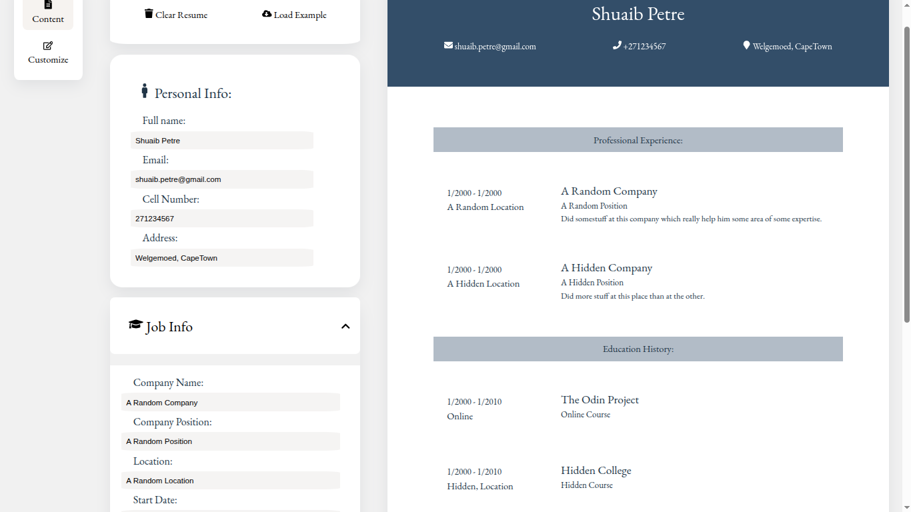
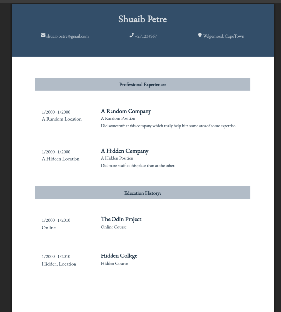

# 🧾 React CV Builder

A responsive and customizable **React-based resume builder** that lets users create, preview, and download a clean CV layout. Built with modular components for personal info, work experience, and education — comes with styling and font editing.

 
 

## 🚀 Features

- 🧑‍💼 Add personal details, work experience, and education
- 🎨 Dynamic color customization
- 📄 Download your resume as **PDF**
- 🧩 Component-based structure (easy to extend)
- ⚡ Built with **React**, **Vite**, and modern CSS

## 📦 Tech Stack

- React (Functional Components & Hooks)
- Vite (Fast dev/build)
- Tailwind CSS or Custom CSS
- `html2canvas` + `jsPDF` for PDF export

## 🔧 Setup Instructions

```bash
# 1. Clone the repository
git clone https://github.com/ShuaibPetre/React-CV.git
cd React-CV

# 2. Install dependencies
npm install

# 3. Start the development server
npm run dev
